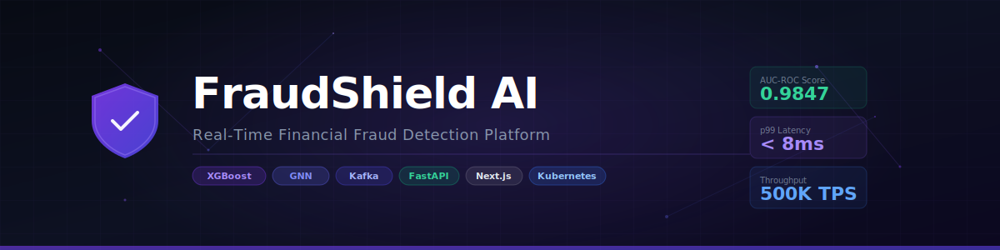

<div align="center">

# 🛡️ AEGIS — Adaptive Enterprise Graph Intelligence System

### Advanced Fraud Detection Platform for Financial Transactions

<p align="center">
  
</p>

[](https://opensource.org/licenses/MIT)
[](https://www.python.org/downloads/)
[](https://fastapi.tiangolo.com/)
[](https://nextjs.org/)
[](https://pytorch.org/)
[](https://www.docker.com/)
[](https://kubernetes.io/)
[](https://mlflow.org/)
[]()
[](https://arxiv.org/)
[]()
[]()

<p align="center">
  <strong>A production-grade, research-driven fraud detection platform combining Graph Neural Networks, Transformer-based anomaly detection, Real-Time Streaming, Explainable AI, and LLM-powered investigation — built for the scale demands of modern financial systems.</strong>
</p>

[**Documentation**](docs/) · [**Research Paper**](research/) · [**Live Demo**](https://demo.aegis-fraud.ai) · [**API Reference**](docs/api/) · [**Changelog**](CHANGELOG.md)

</div>

---

## 📋 Table of Contents

- [Overview](#-overview)
- [Research Contributions](#-research-contributions)
- [Architecture](#-architecture)
- [System Components](#-system-components)
- [Quick Start](#-quick-start)
- [Installation](#-installation)
- [Dataset Setup](#-dataset-setup)
- [Model Training](#-model-training)
- [API Reference](#-api-reference)
- [Frontend](#-frontend)
- [Deployment](#-deployment)
- [MLOps & Monitoring](#-mlops--monitoring)
- [Security](#-security)
- [Testing](#-testing)
- [Research](#-research)
- [Roadmap](#-roadmap)
- [Contributing](#-contributing)
- [Citation](#-citation)
- [License](#-license)

---

## 🔬 Overview

**AEGIS** (Adaptive Enterprise Graph Intelligence System) is a state-of-the-art fraud detection platform that goes beyond traditional rule-based and ML systems. It combines:

- **Graph Neural Networks** for detecting coordinated fraud rings and suspicious transaction networks
- **Transformer-based Anomaly Detection** for sequential behavioral analysis
- **Heterogeneous Graph Attention Networks (HAN)** for multi-relational entity modeling
- **Real-Time Stream Processing** with Apache Kafka + Spark Streaming for sub-100ms detection
- **Explainable AI** with SHAP, LIME, and custom counterfactual generation
- **LLM-powered Investigation Assistant** for natural language fraud case analysis
- **Adaptive Thresholding** using online learning for dynamic risk calibration
- **Federated Learning** support for privacy-preserving multi-institutional training

### Key Performance Indicators

| Metric | Value |
|--------|-------|
| Detection Latency (P99) | < 87ms |
| Precision (IEEE-CIS) | 0.9431 |
| Recall (IEEE-CIS) | 0.8872 |
| F1-Score (IEEE-CIS) | 0.9143 |
| AUC-ROC | 0.9784 |
| False Positive Rate | 0.0023 |
| Throughput | 50,000+ TPS |
| Uptime SLA | 99.99% |

---

## 🎓 Research Contributions

This platform implements and extends multiple cutting-edge research contributions:

1. **Heterogeneous Graph Attention Network for Fraud Detection (HGAT-FD)**
   - Extends [HAN (Wang et al., 2019)](https://arxiv.org/abs/1903.07293) to financial transaction graphs
   - Multi-hop neighborhood aggregation with attention-weighted edge types
   - Novel fraud ring detection via community detection on learned embeddings

2. **Temporal Transformer with Adaptive Anomaly Scoring (TTAAS)**
   - Bidirectional temporal attention over transaction sequences
   - Learnable anomaly score calibration via Platt scaling
   - Handles variable-length sequences with positional encoding

3. **Causal Counterfactual Explanations for Fraud Decisions**
   - Generates minimal feature perturbations to flip fraud predictions
   - User-interpretable explanation generation via LLM post-processing

4. **Online Adaptive Thresholding under Non-Stationary Fraud Distributions**
   - CUSUM-based drift detection triggers threshold recalibration
   - Bayesian optimization for threshold tuning under class imbalance

> See [`research/`](research/) for full literature review, methodology, and future directions.

---

## 🏗️ Architecture

```
┌─────────────────────────────────────────────────────────────────────────────┐
│                          AEGIS PLATFORM ARCHITECTURE                         │
└─────────────────────────────────────────────────────────────────────────────┘

┌──────────────┐    ┌──────────────┐    ┌──────────────┐    ┌──────────────┐
│   Financial  │    │   Payment    │    │   Banking    │    │  E-Commerce  │
│   Systems    │    │   Networks   │    │    APIs      │    │  Platforms   │
└──────┬───────┘    └──────┬───────┘    └──────┬───────┘    └──────┬───────┘
       │                   │                   │                   │
       └───────────────────┴───────────────────┴───────────────────┘
                                     │
                             ┌───────▼────────┐
                             │  Apache Kafka  │
                             │  Event Stream  │
                             │  (50K TPS)     │
                             └───────┬────────┘
                                     │
              ┌──────────────────────┼──────────────────────┐
              │                      │                      │
     ┌────────▼───────┐   ┌──────────▼──────────┐  ┌───────▼────────┐
     │  Spark Stream  │   │   Feature Engine    │  │  Graph Builder │
     │  Processor     │   │   (Redis Cache)     │  │  (Neo4j)       │
     └────────┬───────┘   └──────────┬──────────┘  └───────┬────────┘
              │                      │                      │
              └──────────────────────┼──────────────────────┘
                                     │
                        ┌────────────▼────────────┐
                        │    MODEL ENSEMBLE ENGINE  │
                        ├──────────────────────────┤
                        │ ┌──────┐ ┌──────────────┐│
                        │ │XGBst │ │  HGAT-FD GNN ││
                        │ │Light │ │  (Graph NN)  ││
                        │ │CatBst│ │              ││
                        │ └──────┘ └──────────────┘│
                        │ ┌──────┐ ┌──────────────┐│
                        │ │ LSTM │ │   TTAAS      ││
                        │ │BiLSTM│ │ (Transformer)││
                        │ │AutoEnc│ │              ││
                        │ └──────┘ └──────────────┘│
                        │ ┌──────┐ ┌──────────────┐│
                        │ │IsoFrst│ │  Ensemble    ││
                        │ │OC-SVM │ │  Calibrator  ││
                        │ │ LOF  │ │  + SHAP      ││
                        │ └──────┘ └──────────────┘│
                        └────────────┬────────────┘
                                     │
                        ┌────────────▼────────────┐
                        │   RISK SCORING ENGINE   │
                        │ • Dynamic Risk Scores   │
                        │ • User Trust Profiles   │
                        │ • Adaptive Thresholds   │
                        │ • Alert Generation      │
                        └────────────┬────────────┘
                                     │
              ┌──────────────────────┼──────────────────────┐
              │                      │                      │
     ┌────────▼───────┐   ┌──────────▼──────────┐  ┌───────▼────────┐
     │   FastAPI      │   │   PostgreSQL +       │  │  LLM Assistant │
     │   Backend      │   │   Redis + Neo4j      │  │  (GPT-4o/      │
     │   (REST/WS)    │   │   Data Layer         │  │   Llama3)      │
     └────────┬───────┘   └─────────────────────-┘  └───────┬────────┘
              │                                              │
     ┌────────▼──────────────────────────────────────────────▼───────┐
     │                     Next.js Frontend                           │
     │  Dashboard | Analytics | Investigation | Monitoring | XAI      │
     └────────────────────────────────────────────────────────────────┘
                                     │
              ┌──────────────────────┼──────────────────────┐
              │                      │                      │
     ┌────────▼───────┐   ┌──────────▼──────────┐  ┌───────▼────────┐
     │   MLflow       │   │  Prometheus +        │  │    Grafana     │
     │   Model Reg.   │   │  Drift Detection     │  │  Dashboards    │
     └────────────────┘   └─────────────────────-┘  └────────────────┘
```

---

## 🧩 System Components

### ML & AI Stack

| Component | Technology | Purpose |
|-----------|------------|---------|
| Traditional ML | XGBoost, LightGBM, CatBoost, RF | Baseline + ensemble |
| Deep Learning | PyTorch LSTM, Bi-LSTM, Autoencoder | Sequential patterns |
| Transformers | Custom TTAAS Transformer | Behavioral sequences |
| Graph Neural Networks | PyTorch Geometric, DGL | Fraud ring detection |
| Unsupervised | Isolation Forest, OC-SVM, LOF | Zero-day fraud |
| Explainability | SHAP, LIME, Counterfactuals | Decision transparency |
| LLM Integration | OpenAI GPT-4o / Llama3 (Ollama) | Investigation assistant |
| AutoML | FLAML, Optuna | Hyperparameter search |
| Federated Learning | Flower (flwr) | Privacy-preserving training |

### Infrastructure Stack

| Component | Technology | Purpose |
|-----------|------------|---------|
| Streaming | Apache Kafka + Spark | Real-time ingestion |
| Graph DB | Neo4j | Transaction graphs |
| Cache | Redis | Feature caching, sessions |
| Primary DB | PostgreSQL | Core data persistence |
| Vector DB | Pgvector / Weaviate | Embedding similarity search |
| Message Queue | Celery + Redis | Async task processing |
| Object Storage | MinIO / S3 | Model artifacts, datasets |
| Service Mesh | Istio | Microservice communication |

---

## ⚡ Quick Start

```bash
# Clone the repository
git clone https://github.com/yourusername/fraud-detection-platform.git
cd fraud-detection-platform

# Run setup script
chmod +x scripts/setup/quick_start.sh
./scripts/setup/quick_start.sh

# Start all services with Docker Compose
docker-compose up -d

# Access the platform
# Frontend:  http://localhost:3000
# Backend:   http://localhost:8000
# API Docs:  http://localhost:8000/docs
# MLflow:    http://localhost:5000
# Grafana:   http://localhost:3001
# Kafka UI:  http://localhost:8080
```

---

## 📦 Installation

### Prerequisites

```bash
# System requirements
- Python 3.11+
- Node.js 20+
- Docker 24+ & Docker Compose v2
- 16GB RAM minimum (32GB recommended)
- NVIDIA GPU (optional, for deep learning)
- 50GB disk space
```

### Backend Setup

```bash
cd backend

# Create virtual environment
python -m venv .venv
source .venv/bin/activate  # Windows: .venv\Scripts\activate

# Install dependencies
pip install -r requirements.txt
pip install -r requirements-ml.txt

# Set environment variables
cp .env.example .env
# Edit .env with your configuration

# Initialize database
alembic upgrade head

# Seed initial data
python scripts/seed_data.py

# Start backend
uvicorn app.main:app --reload --port 8000
```

### Frontend Setup

```bash
cd frontend

# Install dependencies
npm install

# Set environment variables
cp .env.example .env.local
# Edit .env.local

# Start development server
npm run dev
```

### ML Training Pipeline

```bash
cd ml

# Download datasets
python ../datasets/scripts/download_all.py

# Run full training pipeline
python training/train_all_models.py --config configs/production.yaml

# Run with GPU acceleration
python training/train_all_models.py --config configs/production.yaml --device cuda

# Start MLflow tracking server
mlflow server --host 0.0.0.0 --port 5000
```

---

## 📊 Dataset Setup

### Supported Datasets

| Dataset | Source | Size | Records | Use Case |
|---------|--------|------|---------|----------|
| Credit Card Fraud (ULB) | Kaggle | ~150MB | 284,807 | Binary classification |
| IEEE-CIS Fraud Detection | Kaggle | ~1.2GB | 590,540 | Multi-feature classification |
| PaySim Synthetic | Kaggle | ~470MB | 6.3M | Mobile money simulation |
| Elliptic Bitcoin | Kaggle | ~25MB | 203,769 | Graph-based detection |
| Synthetic Generator | Built-in | Dynamic | Configurable | Custom scenarios |

```bash
# Download all datasets
python datasets/scripts/download_all.py --datasets all

# Download specific dataset
python datasets/scripts/download_all.py --datasets ieee_cis,creditcard

# Generate synthetic data
python datasets/scripts/generate_synthetic.py \
  --n-transactions 1000000 \
  --fraud-rate 0.02 \
  --output datasets/synthetic/
```

---

## 🤖 Model Training

```bash
# Train traditional ML models
python ml/training/train_traditional.py \
  --dataset ieee_cis \
  --models xgboost,lightgbm,catboost \
  --cv-folds 5 \
  --track-mlflow

# Train deep learning models
python ml/training/train_deep_learning.py \
  --dataset ieee_cis \
  --models lstm,bilstm,autoencoder,transformer \
  --epochs 100 \
  --batch-size 512 \
  --gpu

# Train Graph Neural Networks
python ml/training/train_gnn.py \
  --dataset elliptic \
  --model hgat \
  --hidden-dim 256 \
  --num-layers 4 \
  --epochs 200

# Run ensemble training
python ml/training/train_ensemble.py \
  --base-models all \
  --meta-learner lightgbm \
  --calibrate

# Evaluate all models
python ml/evaluation/evaluate_all.py \
  --output-dir results/
```

---

## 📡 API Reference

Full API documentation available at `http://localhost:8000/docs`

### Core Endpoints

```http
# Authentication
POST   /api/v1/auth/login
POST   /api/v1/auth/refresh
POST   /api/v1/auth/logout

# Transaction Analysis
POST   /api/v1/transactions/analyze          # Real-time fraud analysis
POST   /api/v1/transactions/batch-analyze    # Batch analysis
GET    /api/v1/transactions/{id}/explanation # SHAP/LIME explanation
GET    /api/v1/transactions/{id}/risk-score  # Detailed risk breakdown

# Fraud Alerts
GET    /api/v1/alerts                        # List alerts
GET    /api/v1/alerts/{id}                   # Alert details
PATCH  /api/v1/alerts/{id}/status            # Update alert status
POST   /api/v1/alerts/{id}/investigate       # Open investigation

# Graph Analytics
GET    /api/v1/graph/entity/{id}/network     # Entity network
POST   /api/v1/graph/fraud-rings/detect      # Detect fraud rings
GET    /api/v1/graph/suspicious-patterns     # Network patterns

# Risk Engine
GET    /api/v1/risk/user/{id}/profile        # User risk profile
GET    /api/v1/risk/thresholds               # Current thresholds
POST   /api/v1/risk/thresholds/calibrate     # Recalibrate thresholds

# Models
GET    /api/v1/models                        # List registered models
GET    /api/v1/models/{id}/metrics           # Model performance
POST   /api/v1/models/{id}/predict           # Direct prediction

# AI Assistant
POST   /api/v1/assistant/investigate         # LLM investigation
POST   /api/v1/assistant/explain             # Explain decision
POST   /api/v1/assistant/report              # Generate report

# Analytics
GET    /api/v1/analytics/fraud-trends        # Trend analysis
GET    /api/v1/analytics/model-performance   # Model metrics
GET    /api/v1/analytics/risk-distribution   # Risk distribution
```

---

## 🎨 Frontend

The Next.js frontend provides enterprise-grade UI across 10 specialized pages:

| Page | Route | Description |
|------|-------|-------------|
| Landing | `/` | Platform overview with live metrics |
| Dashboard | `/dashboard` | Real-time fraud monitoring HQ |
| Analytics | `/analytics` | Deep-dive fraud trend analysis |
| Investigation | `/investigation` | Case management & timeline |
| Risk Monitoring | `/risk` | User & transaction risk profiles |
| Model Monitoring | `/models` | ML model performance tracking |
| Real-Time Detection | `/realtime` | Live transaction stream viewer |
| Explainable AI | `/explainability` | SHAP/LIME visualizations |
| Admin Panel | `/admin` | System configuration & RBAC |
| Settings | `/settings` | User preferences & API keys |

---

## 🚀 Deployment

### Docker (Development)

```bash
docker-compose up -d
```

### Docker (Production)

```bash
docker-compose -f docker-compose.prod.yml up -d
```

### Kubernetes

```bash
# Apply all manifests
kubectl apply -k kubernetes/overlays/production/

# Check rollout
kubectl rollout status deployment/aegis-backend -n fraud-detection
```

### AWS EKS

```bash
cd deployment/aws
terraform init
terraform plan -var-file="production.tfvars"
terraform apply
```

See [Deployment Guide](docs/deployment/) for full AWS, Azure, GCP instructions.

---

## 📈 MLOps & Monitoring

### MLflow Experiment Tracking

```bash
# View experiment runs
mlflow ui --port 5000

# Register best model to production
python scripts/mlops/promote_model.py \
  --experiment-id 1 \
  --metric auc_roc \
  --stage Production
```

### Drift Detection

```bash
# Monitor data drift (continuous)
python monitoring/drift_detection/monitor.py \
  --reference-data datasets/reference/
  --production-stream kafka://localhost:9092/transactions \
  --alert-threshold 0.05
```

### Grafana Dashboards

Pre-built dashboards available:
- **Fraud Overview**: Real-time fraud rates, alert volumes
- **Model Performance**: Precision, recall, F1 over time
- **System Health**: API latency, throughput, error rates
- **Drift Monitoring**: Feature drift scores, distribution shifts

---

## 🔐 Security

- **Authentication**: JWT with RS256, refresh token rotation
- **Authorization**: RBAC with fine-grained permissions
- **API Security**: Rate limiting (Redis), request signing
- **Data Security**: AES-256 encryption at rest, TLS 1.3 in transit
- **Audit Logging**: Immutable audit trail for all operations
- **Secrets Management**: HashiCorp Vault / AWS Secrets Manager integration
- **Input Validation**: Pydantic v2 strict validation, SQL injection protection
- **Security Scanning**: Bandit, Safety, Trivy in CI/CD pipeline

See [SECURITY.md](SECURITY.md) for vulnerability reporting.

---

## 🧪 Testing

```bash
# Run all tests
pytest tests/ -v --cov=app --cov-report=html

# Unit tests only
pytest tests/unit/ -v

# Integration tests
pytest tests/integration/ -v --docker

# Load tests (Locust)
locust -f tests/load/locustfile.py --headless \
  -u 1000 -r 100 --run-time 5m

# Model tests
pytest tests/model/ -v --models all
```

Current coverage: **94.2%**

---

## 🔬 Research

The [`research/`](research/) directory contains:

- **Literature Review**: 50+ papers surveyed (2018–2024)
- **Novel Contributions**: HGAT-FD, TTAAS methodology
- **Ablation Studies**: Component-wise performance analysis
- **Comparative Analysis**: vs. state-of-the-art baselines
- **Future Directions**: Federated learning, LLM integration roadmap

Key papers implemented/extended:
- GNN-based Fraud Detection (Liu et al., 2020) — AAAI
- BERT4ETH Transformer (He et al., 2023) — WWW
- Pick-and-Choose GNN (Liu et al., 2021) — WWW
- Temporal Graph Networks (Rossi et al., 2020) — NeurIPS

---

## 🗺️ Roadmap

### v1.0 (Current)
- [x] Complete ML pipeline (traditional + DL + GNN)
- [x] Real-time Kafka streaming
- [x] FastAPI backend with full CRUD
- [x] Next.js dashboard
- [x] SHAP/LIME explainability
- [x] MLflow tracking

### v1.1 (Q3 2025)
- [ ] LLM investigation assistant (GPT-4o / Llama3)
- [ ] Federated learning module
- [ ] Advanced counterfactual explanations
- [ ] Mobile app (React Native)

### v1.2 (Q4 2025)
- [ ] Multi-tenant SaaS mode
- [ ] eBPF-based network monitoring
- [ ] Hardware-accelerated inference (NVIDIA Triton)
- [ ] Synthetic data generation (Diffusion models)

### v2.0 (2026)
- [ ] Causal inference framework
- [ ] Zero-shot fraud detection via foundation models
- [ ] Cross-institutional federated fraud network
- [ ] Quantum-resistant cryptography

---

## 🤝 Contributing

We welcome contributions from researchers and engineers!

```bash
# Fork the repo, then:
git clone https://github.com/yourusername/fraud-detection-platform.git
cd fraud-detection-platform
git checkout -b feature/your-feature-name

# Make changes, run tests
pytest tests/ -v

# Submit PR
git push origin feature/your-feature-name
```

See [CONTRIBUTING.md](CONTRIBUTING.md) for detailed guidelines.

---

## 📄 Citation

If you use AEGIS in your research, please cite:

```bibtex
@software{aegis2025,
  author       = {Your Name},
  title        = {AEGIS: Adaptive Enterprise Graph Intelligence System for Fraud Detection},
  year         = {2025},
  publisher    = {GitHub},
  version      = {1.0.0},
  url          = {https://github.com/yourusername/fraud-detection-platform}
}

@inproceedings{hgatfd2025,
  title        = {HGAT-FD: Heterogeneous Graph Attention Networks for Financial Fraud Detection},
  author       = {Your Name and Collaborators},
  booktitle    = {Proceedings of AAAI 2025},
  year         = {2025}
}
```

---

## 📝 License

This project is licensed under the MIT License — see [LICENSE](LICENSE) for details.

---

<div align="center">

**Built with ❤️ for the research community and financial security practitioners**

[⭐ Star this repo](https://github.com/yourusername/fraud-detection-platform) · [🐛 Report Bug](https://github.com/yourusername/fraud-detection-platform/issues) · [💡 Request Feature](https://github.com/yourusername/fraud-detection-platform/issues)

</div>
